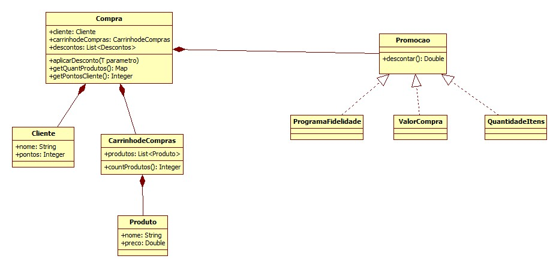

### Análise do problema de um mini-sistema de Varejo

#### Requisitos

- Uma rede do Varejo deseja realizar uma política de descontos.
- Se o valor da compra for superior a 1000 reais o desconto deve ser de 10% no valor total.
- No programa de fidelidade da Rede, caso o cliente já tenha 1000 pontos ou mais deve ser aplicado um desconto de 5%
- Os itens da Compra que tenham quantidade igual ou superior a 20, devem ser aplicados 10%, neste item..
- Novas regras podem surgir.
O classe Compra deve lidar com a Promoção aplicada a ele de acordo com as regras acima.

#### Diagrama de Classes

> Pode sofrer alterações futuras por conta de refatorações, modelo inicial.

>**Autor :** Marlysson Silva