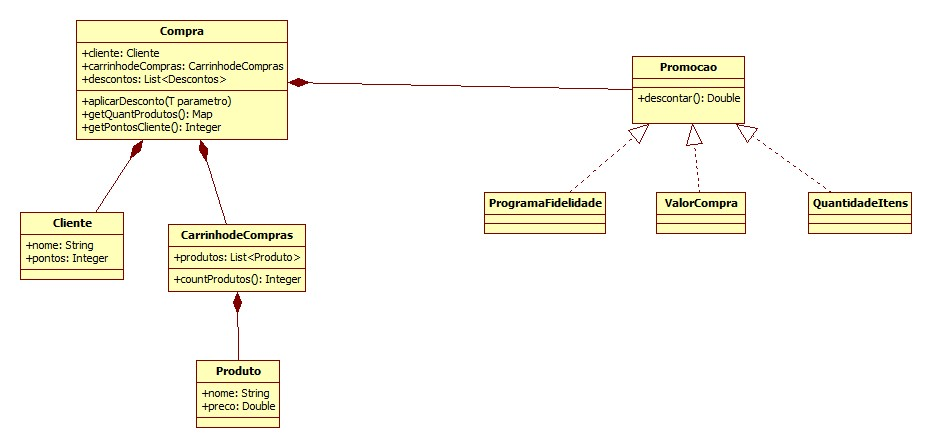

### Análise do problema de um mini-sistema de Varejo

#### Requisitos

>
- Uma rede do Varejo deseja realizar uma política de descontos.
- Se o valor da compra for superior a 1000 reais o desconto deve ser de 10% no valor total.
- No programa de fidelidade da Rede, caso o cliente já tenha 1000 pontos ou mais deve ser aplicado um desconto de 5%
- Os itens da Compra que tenham quantidade igual ou superior a 20, devem ser aplicados 10%, neste item..
- Novas regras podem surgir.
O classe Compra deve lidar com a Promoção aplicada a ele de acordo com as regras acima.

#### Organização da Aplicação
- Modelos
- Regras de Negócio
- Testes

#### Detalhes da separação da aplicação

- **Modelos**

	- ```produto.py``` : Representa o produto em si, com seus atributos para representá-lo.
	- ```cliente.py``` : Representa um cliente que fará a compra no sistema.
	- ```carrinho.py``` : Possui uma classe ```Carrinho()``` responsável por armazenar os itens da compra representados pelo ```Produto()```
	- ```compra.py``` : Representa a ação em si, sendo composto por composições de ```Carrinho()``` , ```Cliente()``` e as regras de descontos ```Promocao()```.

- **Regras de Negócio**

	>Possui as regras para representar as promoções que podem ser implementadas em uma compra; é uma "interface".

	- Interface
		- ```promocao.py```

	- Implementações
		- ```compra_cara.py```
		- ```fidelidade_pontos.py```
		- ```quantidade_itens.py```

- **Testes**
	>Possui os testes de cada modelo implmementado na aplicação.

	- Arquivos
		- ```test_carrinho.py```
		- ```test_cliente.py```
		- ```test_compra.py```
		- ```test_produto.py```

#### Diagrama de Classes

> Observação: Modelo de base para começar a implementar.



> Pode sofrer alterações futuras por conta de refatorações, modelo inicial.

>**Autor :** Marlysson Silva